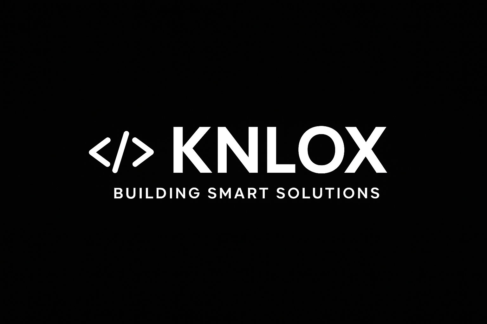

  

## KNLOX Video

https://github.com/knlox/knlox/raw/main/KNLOX.mp4

# Hi, I'm Engr. Francisco III G. Franco  

🎓 **Computer Engineering Graduate** | 💻 **Full-Stack Developer** | **KNLOX Founder**  

I’m a passionate developer who loves turning ideas into real solutions — from web and mobile applications to IoT and AI-powered systems. My journey includes programming competitions, hackathons, and building my own tech brand **KNLOX**.  

---

## Technical Skills
- **Languages & Frameworks:** Java, Python, C++, PHP (CodeIgniter 4), Spring, JavaScript, HTML/CSS  
- **Databases:** PostgreSQL, MySQL, SQLite  
- **Tools & Platforms:** Postman, Git/GitHub, DBeaver, VS Code, IntelliJ IDEA, PyCharm, XAMPP  
- **Systems & Networking:** Linux (Fedora, Arch-Hyperland), Windows, Networking Fundamentals  
- **Other Skills:** Hardware troubleshooting, Microsoft Office, Data Analytics  

---

## Featured Projects (Work in Progress)
- **KNLOX Reminder** – AI-powered mobile reminder app built with Flutter  
- **Hospital Management System** – Built with CodeIgniter 4 + MySQL  
- **KNLOX Guitar Tab Maker** – CRUD web app using Spring Boot, React, and PostgreSQL  
- **IoT Water Monitoring & Renewable Energy System** – ESP32 + sensors + web dashboard  

---

## Achievements
- 2nd Runner-Up, **Python Programming** – ICpEP.se Region XII (2024 & 2025)  
- Champion, **Sumobot Competition** – SKSU Robotics TechXplorers (2023)  
- Music Director, **SKSU TechnoBand** (2024)  
- Participant, **HackForGov Capture the Flag – DICT Region XII** (2024)
- Participant, **University Capture the Flag – TrendMicro** (2024) 

---

## Education
- **Bachelor of Science in Computer Engineering**  
  Sultan Kudarat State University – Class of 2025  

---

## Let’s Connect
- Email: **thirdfrank11@gmail.com**  
- jobstreet: **https://ph.jobstreet.com/profile/franciscoiii-franco-wLLZ6jnGRF**  
- Portfolio: **https://github.com/knlox**

---

⭐️ *“Always curious, always building – let’s create something amazing together with KNLOX.”*

